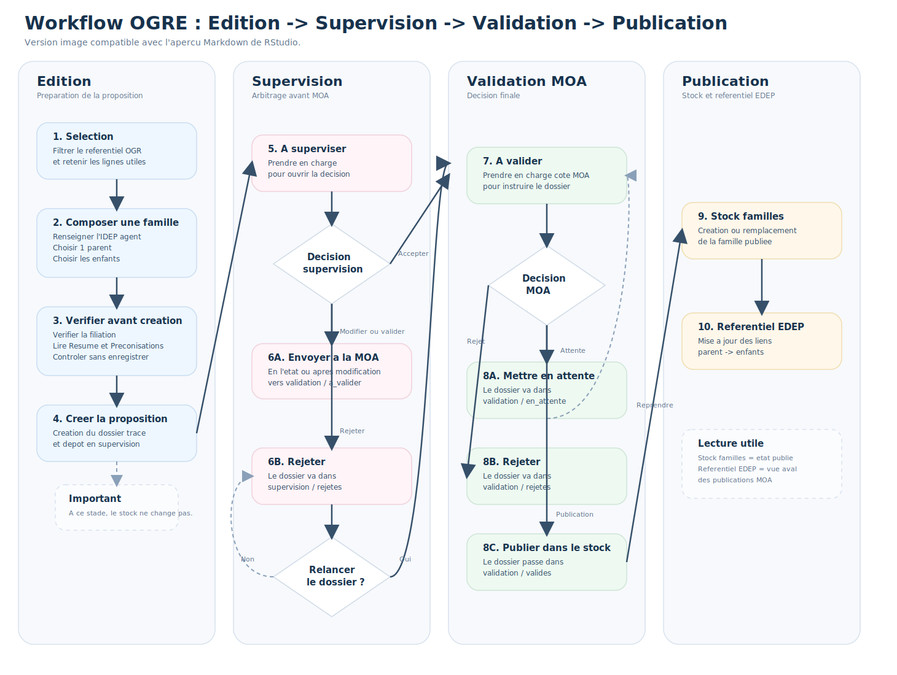
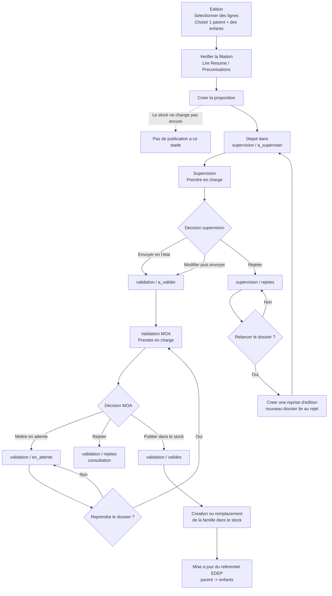

# Logigramme workflow edition -> validation

## Schema image compatible RStudio



Note : le bloc Mermaid ci-dessous reste utile sur les viewers qui le rendent, mais RStudio peut ne pas l'afficher. Une version texte compatible RStudio est conservee plus bas.



## Version texte compatible RStudio

```text
Edition
  -> Selectionner des lignes
  -> Choisir 1 parent + des enfants
  -> Verifier la filiation
  -> Lire Resume / Preconisations
  -> Creer la proposition
  -> Depot dans supervision / a_superviser

Supervision
  -> Prendre en charge
  -> Decision supervision :
     - Envoyer en l'etat -> validation / a_valider
     - Modifier puis envoyer -> validation / a_valider
     - Rejeter -> supervision / rejetes

Supervision / rejetes
  -> Relancer le dossier ?
     - Oui -> creer une reprise d'edition -> retour dans supervision / a_superviser
     - Non -> rester en rejet

Validation MOA
  -> Prendre en charge
  -> Decision MOA :
     - Mettre en attente -> validation / en_attente
     - Reprendre plus tard -> retour en validation / en_cours
     - Rejeter -> validation / rejetes
     - Publier dans le stock -> validation / valides

Publication
  -> Creation ou remplacement de la famille dans le stock
  -> Mise a jour du referentiel EDEP parent -> enfants
```
