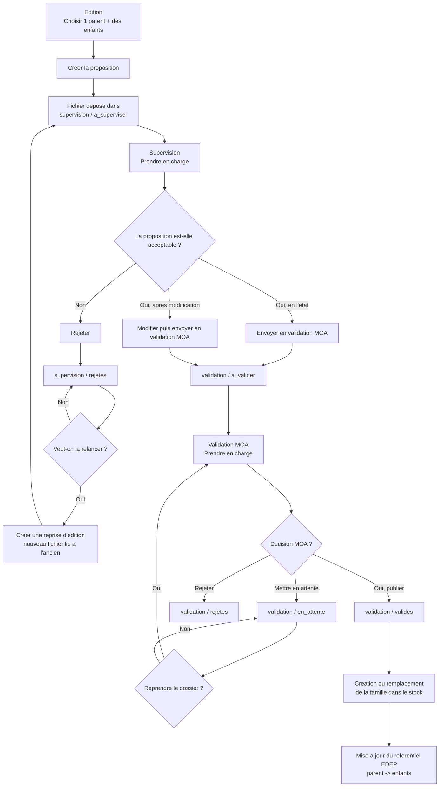

# Logigramme workflow edition -> validation

```mermaid
flowchart TD
    A["Edition<br/>Choisir 1 parent + des enfants"] --> B["Creer la proposition"]
    B --> C["Fichier depose dans<br/>supervision / a_superviser"]

    C --> D["Supervision<br/>Prendre en charge"]
    D --> E{"La proposition est-elle acceptable ?"}

    E -- "Non" --> F["Rejeter"]
    F --> G["supervision / rejetes"]
    G --> H{"Veut-on la relancer ?"}
    H -- "Oui" --> I["Creer une reprise d'edition<br/>nouveau fichier lie a l'ancien"]
    I --> C
    H -- "Non" --> G

    E -- "Oui, en l'etat" --> J["Envoyer en validation MOA"]
    E -- "Oui, apres modification" --> K["Modifier puis envoyer en validation MOA"]

    J --> L["validation / a_valider"]
    K --> L

    L --> M["Validation MOA<br/>Prendre en charge"]
    M --> N{"Decision MOA ?"}

    N -- "Mettre en attente" --> O["validation / en_attente"]
    O --> P{"Reprendre le dossier ?"}
    P -- "Oui" --> M
    P -- "Non" --> O

    N -- "Rejeter" --> Q["validation / rejetes"]

    N -- "Oui, publier" --> R["validation / valides"]
    R --> S["Creation ou remplacement<br/>de la famille dans le stock"]
    S --> T["Mise a jour du referentiel EDEP<br/>parent -> enfants"]
```
